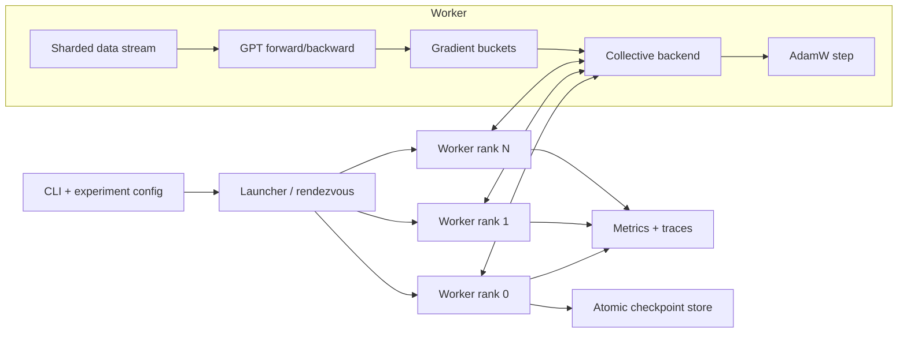

# Distributed GPT Trainer Roadmap

## Executive recommendation

Build a small but rigorous GPT training system that begins as a correct single-process reference and evolves into a fault-aware, observable, benchmarked distributed trainer. Implement the transformer, tokenizer, optimizer, scheduling, data sampling, gradient synchronization, checkpoints, and metrics yourself. Use PyTorch for tensor operations, automatic differentiation, device access, basic `nn.Module`/linear/embedding/activation building blocks, and later low-level distributed primitives and AMP. Keep attention, normalization, loss, and optimizer update equations explicit in the reference path. Trusted PyTorch implementations are welcome as test oracles. Do not use Hugging Face models or Trainer, Lightning, Accelerate, DeepSpeed, or PyTorch's `DistributedDataParallel` to build the main path.

The project is valuable because it creates one coherent body of evidence across five disciplines:

1. **Machine learning:** transformers, optimization, numerical precision, convergence.
2. **Distributed systems:** coordination, collectives, synchronization, failure handling.
3. **Performance engineering:** profiling, bottleneck models, scaling experiments, GPU utilization.
4. **Production engineering:** configuration, observability, testing, reproducibility, checkpoints.
5. **Scientific communication:** hypotheses, controlled experiments, plots, and honest conclusions.

The target is not a large model. The target is a system whose correctness and behavior you can explain from first principles.

**Planning budget:** 16 weeks at 12–15 hours per week, or 192–240 focused hours, for the CPU core. Re-estimate after phases 1 and 3; this is a working budget, not a promise that every experiment will fit.  
**Minimum hardware:** one ordinary computer for the entire CPU core; use Linux CPU CI for a consistent integration environment.  
**Ideal validation hardware:** one Linux machine with two or more CUDA GPUs, plus a brief two-node run if affordable.  
**Portfolio-ready stopping point:** phase 8 with the CPU requirements complete. GPU validation, asynchronous overlap, mixed precision, and multi-node runs are extensions, not blockers for that release.

### Current position and next milestone

Snapshot reviewed on 2026-09-25 against the working tree, including staged work. File presence alone does not count as a completed gate.

| Area | Evidence now | Remaining gate |
|---|---|---|
| Phase 0 foundations | Frozen experiment config and hash, environment report, JSONL event objects/logger, design brief, benchmark protocol, and invariant placeholders. | Working zero-work launcher, real code revision, centralized seeding, tool configuration, and CI. `launch.py` does not yet pass the logger's required `rank`. |
| Phase 1 model/data | Byte tokenizer, contiguous token split, sliding windows, tied-weight GPT, explicit normalization and cross-entropy; 22 unit tests pass. | Full-model causality, loss parity, optimizer parity, tiny-batch overfit, and an integrated trainer. |
| Phase 1 optimizer/training | AdamW update exists; `tests/unit/test_optimizer.py` is empty. | State serialization, learning-rate schedule, clipping, accumulation, evaluation/generation, and deterministic checkpoint/resume. |
| Phases 2–8 | Package layout and five distributed invariant placeholders exist. | Distributed backends, trainer/checkpoint/schedule/metrics modules, config profiles, benchmark scripts, and reproduction scripts are still empty. All five invariant placeholders deliberately fail. |

**Next milestone:** finish the phase-0 runnable baseline, then prove the phase-1 CPU trainer can overfit and resume. Do not start transport or ring work before that numerical reference is trustworthy. Section 13 gives the immediate work queue; update this snapshot when a gate passes.

### Release scope

- **Required for `v1.0.0`:** FP32 CPU oracle; coordinator and ring over local TCP; synchronous Gloo and CPU DDP comparisons; fixed-world-size checkpoint/restart; bounded failures; reproducible CPU measurements and a static report.
- **Optional before release:** NCCL/CUDA validation, asynchronous overlap, mixed precision, a second node, byte-pair encoding, and a live dashboard. Record unrun experiments as unvalidated rather than implying they passed.
- **After release:** choose one specialization from section 9. Optional experiments must not displace correctness, restart, or reproduction work.

---

## 1. North-star demonstration

At the end, a reviewer should be able to launch a demo with one command, follow a short restart procedure, and see two or more workers:

- initialize identical model parameters under the same configuration, with explicit RNG streams for training, data order, and generation;
- receive distinct sample IDs under a documented sharding policy;
- execute a GPT forward and backward pass;
- synchronize gradients with your implementation;
- update to numerically equivalent model states;
- stream loss, throughput, communication time, and worker health;
- save a resumable checkpoint;
- fail promptly after an intentionally killed worker, then resume the whole group from a valid checkpoint with a documented relaunch command;
- reproduce a documented benchmark against a single-process run and PyTorch DDP.

Your demo should answer, with measurements rather than slogans:

- Why are gradients averaged rather than summed?
- When is all-reduce mathematically equivalent to single-process training?
- Why can more workers make training slower?
- Where do latency, bandwidth, batch size, and model size enter the scaling curve?
- What state must a checkpoint contain for a deterministic resume?
- What happens when workers enter collectives in different orders?
- If the overlap extension is implemented, when does it help?
- Which conclusions transfer from a laptop simulation to a GPU cluster—and which do not?

---

## 2. Scope: what to build and what to avoid

### Core system

Build these components:

- a deterministic byte tokenizer, followed by a small byte-pair encoder if time allows;
- a decoder-only transformer with token/position embeddings, causal multi-head self-attention, MLP, residual connections, normalization, and tied output weights;
- cross-entropy loss, AdamW, gradient clipping, warmup plus cosine decay, and autoregressive generation;
- a deterministic data loader and distributed sampler;
- a training loop supporting gradient accumulation;
- two educational collective backends:
  - a synchronous coordinator all-reduce baseline (each worker still owns and updates a full model replica);
  - a ring all-reduce using reduce-scatter plus all-gather;
- a standard Gloo backend using low-level `torch.distributed` collectives, with NCCL as the CUDA extension, without wrapping the main-path model in DDP;
- structured metrics, trace capture, checkpoints, resumption, timeouts, and failure injection;
- a benchmark harness for strong scaling, weak scaling, communication microbenchmarks, and numerical parity;
- a small local dashboard or generated benchmark report.

### Explicit non-goals for the core

- Training a useful foundation model.
- Reimplementing tensor autograd or GEMM.
- Writing a production-grade replacement for NCCL.
- Supporting every model architecture or accelerator.
- Kubernetes, a complex web app, or polished multi-user infrastructure.
- Tensor, pipeline, expert, and context parallelism before data parallelism is complete.
- Distributed inference, serving, RLHF, or fine-tuning features.

These are distractions until the core is correct, measured, and documented.

### The abstraction ladder

Use the same trainer behind progressively more capable communication backends:

| Level | Backend | Purpose |
|---|---|---|
| 0 | No communication | Establish the numerical reference. |
| 1 | Central coordinator over local processes/TCP | Make synchronization and serialization visible. |
| 2 | Your ring all-reduce | Learn collective algorithms and bandwidth tradeoffs. |
| 3 | Gloo via low-level PyTorch collectives | Compare your semantics with a mature CPU backend. |
| 4 | NCCL via low-level PyTorch collectives | Study real GPU communication and overlap. |
| 5 | PyTorch DDP, benchmark only | Establish a production baseline; do not make it the implementation. |

DDP can be compared on CPU with Gloo at level 3; it does not depend on completing the NCCL extension.

This split is important: your own transport is an instrument for learning, while Gloo/NCCL let you investigate realistic performance without pretending a Python socket implementation is production GPU infrastructure.

---

## 3. Proposed architecture



### Stable internal interfaces

Design these interfaces early so implementations can be swapped without rewriting the trainer:

- `ProcessContext`: rank, local rank, world size, device, run ID.
- `CollectiveBackend`: `broadcast`, `all_reduce_sum`, `barrier`, `close`; use a no-op implementation for world size 1. The trainer owns loss/gradient normalization so a backend never averages twice. Keep transport `send`/`recv` internal to educational backends; add async work handles only in phase 5.
- `DistributedSampler`: deterministic sample ownership from epoch, rank, and world size.
- `Trainer`: zero gradients, accumulate forward/backward, synchronize and normalize, unscale if needed, clip, update, log, checkpoint.
- `CheckpointManager`: atomic save, validation, latest-complete discovery, load.
- `EventSink`: append-only structured events from every rank.
- `FaultInjector`: delays, disconnects, corrupt frames, and process termination for tests.

### Suggested repository layout

```text
distributed-gpt/
├── README.md
├── pyproject.toml
├── configs/
│   ├── debug.toml
│   ├── cpu_2worker.toml
│   └── gpu_benchmark.toml
├── src/dgpt/
│   ├── tokenizer.py
│   ├── data.py
│   ├── model.py
│   ├── optimizer.py
│   ├── schedule.py
│   ├── trainer.py
│   ├── checkpoint.py
│   ├── metrics.py
│   ├── launch.py
│   └── distributed/
│       ├── protocol.py
│       ├── coordinator.py
│       ├── ring.py
│       ├── torch_backend.py
│       └── buckets.py
├── tests/
│   ├── unit/
│   ├── numerical/
│   ├── distributed/
│   └── failure/
├── benchmarks/
│   ├── collective.py
│   ├── train_scaling.py
│   └── analyze.py
├── dashboard/
├── docs/
│   ├── architecture.md
│   ├── correctness.md
│   ├── protocol.md
│   └── benchmark-report.md
└── scripts/
    ├── smoke_test.sh
    └── reproduce_core_results.sh
```

This is a target layout; many of these files are currently placeholders. `loss.py`, `config.py`, `event.py`, `event_logger.py`, and `environment.py` also belong in `src/dgpt/` as already implemented. Keep training artifacts outside version control. Record their schema and provide a tiny example rather than committing large checkpoints. Keep benchmark methodology in `docs/protocol.md`; put the future TCP wire format in a separate `docs/wire-protocol.md`.

---

## 4. Definition of done

The CPU core is complete only when all of the following required gates pass. Apply GPU-specific gates only when claiming the GPU extension is validated.

### Correctness

- A tiny model overfits one batch to near-zero loss.
- Causal masking prevents every token from observing future positions.
- AdamW matches a trusted implementation on fixed tensors within a stated tolerance.
- One distributed step matches a single-process global-batch step within a stated tolerance.
- Parameters and optimizer states agree across ranks under declared tolerances; require equal hashes in the deterministic CPU debug profile. Hashes diagnose exact equality, not floating-point closeness across backends or devices.
- Saving and resuming reproduces the uninterrupted run for a documented deterministic configuration on the same software, hardware, and world size.
- The coordinator and ring implementations pass collective tests over multiple tensor sizes and world sizes.

### Distributed behavior

- Two and four CPU workers complete at least 100 steps without deadlock.
- Uneven dataset sizes have an explicit, tested policy: initially drop the incomplete global batch before sharding, so all ranks execute the same number of steps. Padding/masking is optional and requires count-weighted loss normalization.
- A delayed rank is observable as a straggler rather than an unexplained hang.
- Collective mismatch or timeout produces rank-specific diagnostics.
- A killed worker causes bounded group failure, and a documented relaunch resumes from the last valid checkpoint. Automatic restart is optional; tested restart is required.

### Performance

- The benchmark distinguishes compute, communication, input, optimizer, checkpoint, and idle time.
- Both strong- and weak-scaling results are reported.
- Communication microbenchmarks estimate latency and effective bandwidth.
- If claiming the GPU extension, report whether a compute-heavy two-GPU workload improves throughput over one GPU and explain the observed limit. Otherwise explicitly mark GPU scaling unvalidated.
- Results include medians and variability after warmup, not a single lucky measurement.

### Reproducibility and communication

- A new user can run a CPU smoke test from the README in under ten minutes.
- A single script regenerates the core result table and plots.
- The architecture, wire protocol, checkpoint schema, and numerical equivalence argument are documented.
- The repository includes a short demo, a benchmark report, limitations, and a failure postmortem.
- CI runs unit tests plus a two-process CPU integration test.

---

## 5. The core roadmap (16-week planning budget)

The weeks are planning units, not deadlines. Do not advance because the calendar says so; advance when the exit gate passes. Phase 5's CPU baseline is required; its GPU, overlap, and mixed-precision extensions can be deferred. Logging, tests, and basic checkpoints start early; phases 6 and 7 harden and analyze them rather than introduce them for the first time.

### Phase 0 — Frame the experiment (week 1, first half)

**Goal:** make success falsifiable before writing the system.

Build:

- a one-page design brief;
- the repository skeleton, configured formatter/type checker/test runner, a reproducible dependency environment, and CI;
- one immutable experiment configuration object;
- deterministic seed handling and an environment report;
- a structured JSONL event schema with `run_id`, `rank`, `step`, timestamps, metrics, configuration hash, and code revision;
- a benchmark protocol defining warmup, repetitions, synchronization points, and units.

Write down the invariants:

1. All ranks start from identical parameters.
2. Each global step consumes the intended distinct sample IDs; overlapping context in adjacent sliding windows is allowed, but train/validation token ranges remain separate.
3. A synchronized gradient equals the global mean-loss gradient; a simple mean of local means is valid only for equal valid-token counts.
4. All ranks apply the same optimizer update in the same order.
5. Only a fully written and validated checkpoint may be treated as resumable.

**Exit gate:** a zero-work benchmark produces a valid structured result file with actual run/config/code metadata; active tests and configured checks pass in CI. Track future invariants as explicit skips with a milestone and reason, then replace each with real assertions when its phase lands. Permanently failing placeholders are a backlog, not correctness evidence; no invariant placeholders may remain at release.

### Phase 1 — Build the single-process oracle (weeks 1–3)

**Goal:** establish a small, understandable training implementation whose outputs become the distributed truth source.

Build in this order:

1. Fixed byte tokenizer with round-trip tests.
2. Sliding-window dataset with reproducible train/validation split, splitting the source tokens before constructing windows to avoid leakage; a tiny redistributable corpus with provenance and checksum.
3. Token and positional embeddings.
4. Scaled dot-product causal self-attention; then multiple heads.
5. MLP, normalization, residual blocks, final projection, cross-entropy.
6. AdamW with explicit first/second moments, decoupled weight decay, `zero_grad`, and save/load state. Define parameter groups, tied-parameter deduplication, and how missing gradients affect per-parameter step counters.
7. Linear warmup plus cosine learning-rate decay.
8. Gradient clipping, accumulation, evaluation, sampling, and checkpoints.
9. Optional byte-pair encoding after the trainer is working.

Start with the smallest model that exercises the full path (for example, two layers of width 32–64 for tests). Scale toward 1–10 million parameters for measurements only after the trainer works; unit tests and the CPU quick start should stay small.

High-value tests:

- token encode/decode round trip;
- tensor shape and parameter-count assertions;
- future-token perturbation does not change earlier logits;
- attention probabilities are finite and normalized;
- explicit cross-entropy matches a trusted loss in both value and gradient, including large logits;
- manual AdamW matches a trusted optimizer for several steps;
- gradient accumulation over `k` microbatches matches one equivalent batch;
- an atomic checkpoint taken between optimizer steps restores model, optimizer, schedule position, step, consumed tokens, data position, and random-number-generator states; add scaler state when AMP is introduced;
- the model overfits a tiny batch;
- a fixed-budget tiny-corpus run reports train/validation loss and produces samples; generated bytes have an explicit invalid-UTF-8 display policy. Text quality is a diagnostic, not a subjective exit gate.

**Exit gate:** the tiny-batch overfit, optimizer parity, and accumulation tests pass; a 500-step deterministic CPU run can be interrupted, resumed, and matched against the uninterrupted run, including optimizer state and subsequent sample IDs. Use a short resume regression in CI. State the overfit threshold and configuration before running it. Reproducibility is scoped to the pinned environment, not assumed across devices or PyTorch versions ([PyTorch reproducibility guidance](https://docs.pytorch.org/docs/stable/notes/randomness.html)).

**Portfolio artifact:** a concise notebook or report that walks through one transformer block and one optimizer step using tensors from the implementation.

### Phase 2 — Learn process coordination before model distribution (week 4)

**Goal:** make ranks, rendezvous, message framing, synchronization, and failure modes concrete with tiny payloads.

Build:

- a launcher that starts local worker processes;
- assignment of `rank`, `local_rank`, `world_size`, run ID, and coordinator address;
- a length-prefixed binary protocol with message type, run ID, monotonic collective sequence ID, training step, source rank, dtype, shape, payload length, and checksum; training step alone cannot distinguish multiple collectives or buckets;
- tensor serialization without pickle;
- point-to-point send/receive, barrier, broadcast, sum, and mean;
- per-operation deadlines and structured errors, plus a launcher that notices child exits and terminates/reaps the remaining workers;
- protocol versioning and maximum-frame limits.

First implement a central coordinator: workers send tensors to rank 0, rank 0 reduces them including its own contribution, and rank 0 broadcasts the result. Implement sum in the backend and derive mean at the caller. Start with contiguous CPU FP32 tensors, then declare and test the supported dtype/shape matrix and clear rejection of unsupported inputs. Rank 0's bandwidth bottleneck is part of the experiment.

Run microbenchmarks across payload sizes from bytes to tens of megabytes. Fit the simple communication model:

```text
time ≈ latency + bytes / effective_bandwidth
```

Security boundary: the educational TCP service is for trusted private networks only. Bind to loopback by default, never deserialize arbitrary Python objects, validate lengths before allocation, and document that it is not an internet-facing service.

**Exit gate:** collectives give correct results for 2–4 local processes across shapes, dtypes, awkward sizes, delayed ranks, disconnects, and malformed frames. Tests time out with diagnostics rather than hanging forever.

**Portfolio artifact:** a chart showing when fixed latency dominates and when payload bandwidth dominates.

### Phase 3 — Synchronous data-parallel GPT (weeks 5–6)

**Goal:** connect the single-process trainer to the coordinator backend without losing mathematical equivalence.

Build:

- deterministic parameter broadcast from rank 0;
- deterministic assignment of distinct sample IDs to each rank;
- gradient flattening and reconstruction in stable, deduplicated parameter order, including tied weights and an explicit missing-gradient policy;
- sum all-reduce followed by the trainer's normalization (division by world size only for equal-sized local mean losses);
- an explicit global-batch calculation;
- coordinated pauses for rank-0 validation/generation, with separate sampling RNG state so evaluation cannot change training randomness;
- checkpoints at completed optimizer-step boundaries: every rank contributes RNG/data state, while rank 0 writes the replicated model/optimizer state and commits the checkpoint;
- per-rank parameter hashes and gradient norms;
- a debug mode that logs the sample IDs owned by each worker.

For full, unmasked batches, use the identity:

```text
global_batch_tokens = microbatch_size × sequence_length × accumulation_steps × world_size
```

Count actual valid target tokens if padding, masks, or partial batches are later supported. For local mean gradient `g_r` over `n_r` valid tokens accumulated by rank `r`, the required gradient is:

```text
global_gradient = sum_r(n_r * g_r) / sum_r(n_r)
```

For equal-sized microbatches, divide each mean loss by `accumulation_steps`, then divide the reduced gradient by `world_size`. For unequal sizes, accumulate token-summed losses and divide the summed gradients once by the total valid-token count. Begin with full global batches and equal counts; do not add uneven-input support before this path passes.

Construct one global batch, split it across ranks, and compare with the single-process update. Disable stochastic layers for this oracle test (or align randomness per sample). Clip only after accumulation, synchronization, and normalization; clipping each local gradient separately changes the update. Assert distinct window IDs, not disjoint source-token content: neighboring sliding windows intentionally overlap.

Experiments:

1. One process through the collective interface versus the phase-1 oracle.
2. Two workers with equal-sized shards versus one global batch.
3. Two workers where one sleeps before synchronization.
4. Fixed per-worker batch as world size grows.
5. Fixed global batch as world size grows.

**Exit gate:** logits for corresponding examples, reduced gradients, optimizer state, and post-step parameters match the reference within justified tolerances for at least ten steps, including accumulation. Two and four CPU workers complete at least 100 steps; sample ownership, uneven-dataset dropping, and a basic same-world-size resume pass. Checkpoint corruption and failure hardening follow in phase 6.

**Portfolio artifact:** a short correctness note deriving why averaged local gradients reproduce the global-batch gradient—and the exact conditions under which they do not.

### Phase 4 — Implement ring all-reduce (weeks 7–8)

**Goal:** replace the central bandwidth bottleneck with a real collective algorithm you can explain at a whiteboard.

Build:

- flattening, padding, and partitioning a tensor into `world_size` chunks;
- a reduce-scatter phase over the ring;
- an all-gather phase over the ring;
- deadlock-safe send/receive ordering;
- chunk metadata and reconstruction;
- support for non-divisible sizes and empty edge cases;
- optional pipelined subchunks after the basic algorithm is correct.

Derive and document the communication volume. For `N` ranks and `M` padded payload bytes, the basic ring sends `2 * (N - 1) * M / N` bytes per rank and receives the same amount, excluding metadata. Contrast this with the coordinator's rank-0 bottleneck. Separate the algorithmic model from Python/runtime overhead observed on your machine; test a world-size-1 no-op as well.

Tests:

- compare against a local sum for world sizes 2, 3, and 4;
- use zeros, constants, random values, odd tensor lengths, and declared supported dtypes; test non-finite propagation separately from training's non-finite rejection policy;
- test every rank as a possible logical ring start;
- randomize small delays to expose ordering bugs;
- repeat the operation many times to catch tag/step confusion;
- fail loudly when ranks call different collective sequences.

Benchmarks:

- coordinator versus ring by message size and worker count;
- predicted versus measured time;
- effective bandwidth per worker;
- the crossover point, if any, where ring wins in this implementation.

**Exit gate:** the ring passes the numerical and stress suites and its performance behavior has a reasoned explanation. It need not beat Gloo or NCCL.

**Portfolio artifact:** an animation or diagram of reduce-scatter and all-gather plus a measured coordinator-versus-ring plot.

### Phase 5 — Mature CPU baseline, then optional GPU work (weeks 9–10)

**Goal:** preserve your trainer's semantics while swapping in mature CPU and GPU collectives.

Build the required CPU baseline first:

- a synchronous Gloo implementation of `CollectiveBackend`;
- deterministic gradient buckets rather than one collective per parameter;
- the same accumulation semantics as phase 3, synchronizing only after the final microbatch;
- a CPU DDP benchmark adapter used only as a reference, with the same model, optimizer, batches, loss normalization, and update count. Match synchronization frequency when accumulating.

Then, if hardware and time permit, add NCCL with one process per CUDA device, asynchronous handles and overlap, and finally AMP. Validate each independently before combining them. Carry unfinished extensions past `v1.0.0` rather than deferring recovery or the report.

Experiment with bucket size. Small buckets pay more collective-launch overhead; larger buckets can improve bandwidth use. With the overlap extension, small buckets may start communication earlier while large buckets wait longer for gradients. Capture traces rather than guessing.

Compare the first two for the CPU release; add the third only with the overlap extension:

1. Per-parameter synchronous all-reduce.
2. Bucketed synchronous all-reduce.
3. Bucketed asynchronous all-reduce with safe overlap (optional).

For overlap, synchronize a bucket only when every gradient it contains has its final accumulated value, including all uses of tied parameters. Keep buffers alive and unmodified until safe to reuse, and launch collectives in the same predetermined bucket order across ranks. The optimizer must wait for the result on the stream that consumes it; CUDA work-handle waits do not necessarily block the host ([PyTorch collective completion semantics](https://docs.pytorch.org/docs/stable/distributed.html#synchronous-and-asynchronous-collective-operations)).

For the AMP extension, start with BF16 where supported, then FP16 with scaling. Keep FP32 optimizer state and verify the custom optimizer's scaler integration. Hold the loss scale fixed throughout accumulation; finish reduction, unscale, then clip. Every rank must agree on overflow, whether to skip the update, and the next scale. Advance an update-based schedule only on successful updates. Track attempted batches and consumed tokens separately. Follow the [PyTorch AMP accumulation and clipping guidance](https://docs.pytorch.org/docs/stable/notes/amp_examples.html), and test the explicit loss/normalization math under autocast.

**Exit gate:** Gloo passes the phase-3 equivalence suite and is compared with CPU DDP using repeated measurements. For each claimed extension, also require parity and traces on the relevant hardware; AMP needs a one-rank overflow injection that causes all ranks to skip consistently. A CPU-only release explicitly lists these GPU/AMP experiments as unvalidated.

**Portfolio artifact:** one annotated profiler trace explaining exposed communication and a measured bucket-size tradeoff; include overlap only if implemented.

### Phase 6 — Checkpointing and failure engineering (weeks 11–12)

**Goal:** turn a distributed demo into a system that fails intelligibly and preserves useful work.

Checkpoint at minimum:

- model weights;
- AdamW moment tensors and step counters;
- learning-rate scheduler state;
- mixed-precision scaler state when enabled;
- successful optimizer-update count, attempted-batch count, and consumed-token count;
- epoch/data-stream cursor or sampler state per rank, pointing at the next unconsumed data;
- Python, NumPy when used, and PyTorch CPU/device RNG states per rank, including explicit generators;
- world size, model/config hash, tokenizer identity, dataset identity, code revision, and format version.

Checkpoint only after all ranks finish the same update boundary and all communication completes. Gather per-rank state before rank 0 commits; a rank-0-only RNG snapshot is insufficient. Initially use synchronous loading without prefetch, so the saved cursor unambiguously identifies the next batch.

Use an atomic commit protocol on one local filesystem: write to a new temporary checkpoint directory, flush/fsync files, write and validate a manifest with sizes/checksums, then atomically rename it complete and sync the parent directory where supported. Readers ignore incomplete checkpoints and validate contents and compatibility before loading. If the newest candidate is corrupt, try older validated checkpoints and report the fallback. Do not overwrite the last valid checkpoint. Document the filesystem assumptions; atomic rename alone is not a universal durability guarantee.

Add fault scenarios:

- kill a worker before, during, and after an all-reduce;
- delay one worker enough to trigger a timeout;
- terminate rank 0 during checkpoint creation;
- truncate or corrupt a checkpoint file;
- fill the target storage location or simulate a write error;
- send an unexpected step/tag;
- restart with a different world size and reject it unless explicitly supported.

Core recovery policy: fail and reap the worker group within a configured deadline, relaunch the same world size on the same environment, and resume from the latest valid checkpoint. A documented manual relaunch is sufficient; automatic retries need an explicit limit. Ordinary lost work is bounded by the checkpoint interval, while fallback after corruption can lose more and must report how much. Elastic membership and multi-node storage are extensions.

**Exit gate:** every injected failure ends in either verified recovery with bounded lost work or a bounded, actionable error. No scenario silently trains divergent ranks.

**Portfolio artifact:** a blameless incident report for the most interesting failure, including detection gap, root cause, fix, and regression test.

### Phase 7 — Observability and performance science (weeks 13–14)

**Goal:** make the system explain itself.

Record per run:

- training and validation loss;
- learning rate, gradient norm, and skipped updates;
- tokens per second and step time;
- forward, backward, communication, optimizer, data wait, checkpoint, and barrier time;
- per-rank timing so stragglers are visible;
- bytes communicated and effective bandwidth;
- CPU, memory, GPU utilization, and allocated/reserved device memory when available;
- configuration, environment, code revision, seed, and checkpoint lineage.

The dashboard can remain small: run table, aligned loss curves, throughput, time breakdown, worker timeline, and scaling plots. A static report generated from structured data is acceptable and often more reproducible than a web app.

Benchmark protocol:

1. Pin the configuration and record hardware/software.
2. Warm up before measuring.
3. Synchronize workers/devices at measurement-window boundaries; use device events or profiler traces for GPU stages. Do not insert a global synchronization around every stage in the throughput run, because it destroys overlap.
4. Repeat runs and report median plus spread.
5. Separate data loading from synthetic-data compute tests.
6. Compare equivalent tokens and optimization semantics for correctness and strong scaling. Treat weak scaling as a throughput experiment with a changed global batch, not an equivalent learning trajectory.
7. Publish failures and anomalies, not only the best run.

Calculate:

```text
throughput(N)            = total_valid_tokens / measured_wall_seconds
throughput_ratio(N)      = throughput(N) / throughput(1)
throughput_efficiency(N) = throughput_ratio(N) / N
strong_scaling_speedup   = wall_time(1) / wall_time(N)  # same total work
```

Run both:

- **Strong scaling:** fixed global work; divide it among more workers.
- **Weak scaling:** fixed work per worker; global work grows with worker count. Ideal step latency remains flat while total throughput rises.

Measure the worker group's completion time, not just rank 0's local latency. Keep CPU thread counts and available cores explicit so oversubscription does not masquerade as a collective bottleneck. Report collective duration, overlap, and exposed communication wait separately: compute and communication can run concurrently, so their durations need not add up to step time. Do not label summed collective durations divided by step time as a non-overlapping fraction.

Use an explicit bottleneck hypothesis before each optimization, for example: “With 256 KiB buckets, collective launch latency dominates; 8 MiB buckets should improve throughput but reduce overlap.” Then record whether the evidence confirmed it.

**Exit gate:** the benchmark report explains at least one scaling limit, documents the numerical error/tolerance budget, and tests at least one optimization hypothesis with repeatable evidence. A negative result is valid; do not require a speedup to declare the experiment complete. Include a precision tradeoff when the AMP extension is available.

**Portfolio artifact:** a polished report with methodology, plots, profiler evidence, limitations, and raw result files.

### Phase 8 — Package the hiring signal (weeks 15–16)

**Goal:** make depth legible to a busy engineer in five minutes and inspectable for hours.

Ship:

- a README with a 60-second explanation, architecture diagram, quick start, results, and limitations;
- a CPU demo that needs no special hardware;
- a reproducible failure-and-restart demo, with an optional 3–5 minute narration;
- a concise technical report covering the evidence below; no page-count target;
- the correctness proof sketch and test matrix;
- benchmark data and a one-command reproduction path;
- a roadmap showing what you intentionally left out;
- tagged release `v1.0.0`.

Recommended report structure:

1. Problem and design goals.
2. Mathematical semantics of synchronous data parallelism.
3. Coordinator and ring designs.
4. Correctness strategy.
5. Failure model and checkpoint protocol.
6. Benchmark methodology.
7. Results and profiler analysis.
8. Limitations and next experiments.

**Exit gate:** ask an engineer unfamiliar with the project to follow the quick start and explain the main benchmark conclusion. Fix every point where they become confused.

---

## 6. Weekly operating rhythm

Use a consistent loop so the project creates expertise rather than a pile of features.

| Session | Work |
|---|---|
| 1 | Read one primary source; write a prediction or design note. |
| 2 | Implement the smallest vertical slice. |
| 3 | Add numerical, concurrency, and failure tests. |
| 4 | Measure it; capture traces or structured data. |
| 5 | Explain the result in the engineering log and choose the next bottleneck. |

Every week should end with:

- one demonstrable behavior;
- one new automated test;
- one measurement;
- one paragraph explaining what surprised you;
- one explicit decision about scope.

Maintain an engineering log with: hypothesis, setup, evidence, conclusion, confidence, next test. This log will supply the best material for interviews and the final report.

---

## 7. Test and evidence matrix

| Area | Minimum evidence |
|---|---|
| Tokenizer/data | Round trips, stable vocabulary, deterministic sample-ID ownership, separate train/validation token ranges. |
| Model | Shape tests, causal-mask test, tiny-batch overfit, finite activations/gradients. |
| Optimizer | Tensor-level parity, weight-decay behavior, resume parity. |
| Collective | Known sums, odd lengths, multiple dtypes/world sizes, repeated operations, randomized delays. |
| End-to-end math | Global batch versus split batches across multiple updates, including accumulation and clipping; gradients, optimizer state, and parameters compared. |
| Determinism | Continuous versus save/resume; same seeds versus changed seeds. |
| Failure | Worker loss, coordinator loss, timeout, corrupt checkpoint, incomplete write. |
| Performance | Warmup, repeated trials, strong/weak scaling, synthetic-data isolation, trace. |
| Usability | Clean-environment CPU quick start and actionable errors. |

For floating-point checks, declare dtype-specific `atol`/`rtol` and justify them. Never weaken a tolerance merely to make a red test green; first identify whether reduction order, precision, loss normalization, or an actual bug explains the difference.

---

## 8. Benchmark plan

### Workloads

Use three fixed profiles:

- **Debug:** tiny model and sequence; optimized for sub-minute correctness tests.
- **Communication-heavy:** small compute with relatively large gradients; exposes synchronization overhead.
- **Compute-heavy:** larger layers/sequence; allows overlap and GPU scaling to matter.

### Comparison matrix

| Question | Comparison | Release requirement |
|---|---|---|
| Is the distributed math right? | Single-process global batch vs. split batch plus all-reduce. | CPU core |
| What does centralization cost? | Coordinator vs. ring across payload sizes/workers. | CPU core |
| What does a mature backend add? | Ring vs. Gloo; custom Gloo trainer vs. CPU DDP. | CPU core |
| Do buckets help? | Per-parameter vs. several synchronous bucket sizes. | CPU core |
| Is input the bottleneck? | Real loader vs. pre-generated batches on the same device. | CPU core |
| Does it recover? | Baseline vs. fault-injected run with restart time/lost work. | CPU core |
| How does GPU scaling compare? | Low-level NCCL trainer vs. CUDA DDP. | GPU extension |
| Does overlap help? | Synchronous vs. asynchronous bucket reduction with traces. | Overlap extension |
| Does mixed precision help safely? | FP32 vs. BF16/FP16 throughput, memory, and loss. | AMP extension |

Use `docs/protocol.md` as the methodology source of truth. Its starting defaults are 10 warmup steps and five repetitions of 100 measured steps; record all overrides and lengthen warmup if necessary. Populate the empty config profiles before benchmarking. Define independent repetitions, reset state consistently, and keep profiling runs separate from throughput runs. Before expanding the harness, reconcile that document's MB display unit with raw bytes below, and make its loss-logging interval configurable for tiny runs.

### Results table schema

For every row, store:

```text
run_id, repetition_id, commit, dirty_tree, config_hash, environment_id,
dataset_id, tokenizer_id, seed, host, device, backend, world_size,
scaling_mode, cpu_threads_per_rank, available_cpu_cores,
model_parameters, sequence_length, microbatch, accumulation_steps,
global_batch_tokens, measured_valid_tokens, precision, bucket_bytes,
warmup_steps, measured_steps, successful_updates, skipped_updates,
measured_wall_seconds, tokens_per_second, median_step_ms, p95_step_ms,
forward_ms, backward_ms, collective_duration_ms, exposed_comm_wait_ms,
optimizer_ms, data_wait_ms, checkpoint_ms, barrier_ms,
peak_memory_bytes, final_loss, status, error_reason
```

Store per-rank raw events alongside this per-repetition summary; document how each timing statistic is aggregated. Link environment/config manifests through their IDs, including exact dependency versions and hardware. Preserve a source snapshot or patch hash for dirty-tree runs. Use null for unsupported measurements, never zero. For bandwidth, distinguish logical payload bytes from actual per-rank wire traffic; for step percentiles, distinguish local latency from group latency.

Avoid a leaderboard mindset. The report is strongest when it identifies causal mechanisms: a slow run with a convincing trace can show more expertise than an unexplained fast run.

---

## 9. Stretch roadmap: choose one specialization

Do not begin these until the `v1.0.0` core is shipped. Choose one branch that matches the roles you want.

### A. Large-model memory systems

Implement optimizer-state sharding similar to ZeRO stage 1, then parameter/gradient sharding. Measure memory per rank, communication volume, and the model size that becomes feasible. This is the strongest follow-on for ML infrastructure roles.

### B. Tensor parallelism

Shard attention/MLP matrix multiplications across devices. Derive where all-reduce or all-gather is required. Test against the unsharded block. This is high value for large-model training, but it is substantially harder than replicated data parallelism.

### C. Pipeline parallelism

Split layers across workers, implement microbatch schedules, measure pipeline bubbles, and add activation transfer. This emphasizes scheduling and memory/throughput tradeoffs.

### D. Custom kernel path

Write and benchmark a fused operation or attention-related kernel in Triton/CUDA. Integrate it behind the same model interface and prove numerical parity. This targets accelerator and performance roles.

### E. Scheduler/simulator path

Feed measured compute and communication curves into a cluster simulator. Predict training time across device counts, topologies, failures, and checkpoint intervals, then validate small-scale predictions.

### F. Scientific-computing adaptation

Replace GPT with a small PDE, particle, or linear-algebra workload while retaining collectives, checkpointing, metrics, and benchmark infrastructure. This produces the clearest bridge to fusion, climate, aerospace, or computational science.

---

## 10. Why the skills transfer beyond AI labs

The transferable skills are partitioning numerical work, synchronizing it, measuring its behavior, and recovering it across unreliable hardware. Describe the evidence you have and the domain knowledge a new application would still require.

| Project evidence | AI training | Non-AI frontier applications |
|---|---|---|
| Collective communication | Gradient reduction | HPC simulation, distributed linear algebra, signal processing. |
| Partitioning and placement | Data/model sharding | Databases, storage, EDA, robotics fleets, geospatial systems. |
| Numerical equivalence | Training correctness | Physics simulation, computational chemistry, finance, control software. |
| Profiling/roofline thinking | GPU utilization | Chip software, rendering, scientific computing, low-latency systems. |
| Checkpoint/restart | Long training jobs | Fusion/plasma simulation, weather, seismic processing, batch compute. |
| Straggler/failure handling | Cluster reliability | Cloud platforms, storage engines, distributed services. |
| Experiment design | Model systems research | Any research-engineering or performance role. |
| GPU collectives and kernels | Scale-up training | Molecular dynamics, autonomous systems, imaging, digital twins. |

Strong target areas include:

- GPU/accelerator infrastructure and compiler teams;
- cloud/HPC platforms and cluster schedulers;
- databases, storage, and streaming systems;
- semiconductor design automation and chip verification;
- robotics/autonomy simulation and perception infrastructure;
- computational physics, fusion, climate, aerospace, biotech, and materials startups;
- quantitative and other high-performance numerical systems.

The transfer is not automatic. A fusion company still values physics/numerical-method knowledge, a robotics company still values real-time and hardware experience, and a database company still values storage/consensus knowledge. Make the bridge explicit with one targeted stretch project rather than claiming the GPT trainer covers every domain.

---

## 11. Interview and portfolio strategy

### The five-minute story

1. “I wanted to understand distributed training below framework wrappers.”
2. “I built a single-process GPT as a numerical oracle.”
3. “I implemented a central reducer and ring all-reduce, then proved update equivalence.”
4. “I swapped in Gloo, measured bucket-size tradeoffs, and compared with CPU DDP.” Add NCCL or overlap only if validated.
5. “I injected failures, made checkpoints atomic, and published reproducible scaling results.”

### The 30-minute deep dive

Be ready to draw or derive:

- one transformer block and its dominant tensor shapes;
- AdamW state and update equations;
- local versus global batch gradient equivalence;
- reduce-scatter plus all-gather in a ring;
- latency/bandwidth cost models;
- bucket-size and overlap tradeoffs;
- strong versus weak scaling;
- checkpoint consistency and worker-failure behavior;
- a profiler trace and the evidence behind one optimization.

### Honest résumé bullet template

Use your measured results, never placeholder numbers; name only validated backends, hardware, and recovery scenarios:

> Built a decoder-only transformer and synchronous data-parallel training engine with coordinator, ring, and Gloo backends; demonstrated numerical parity with a single-process global-batch reference and measured **[X]** tokens/s across **[N]** workers on **[hardware]** at a fixed global batch of **[B]** tokens.

> Implemented atomic checkpoints with deterministic resume in **[configuration]** and fault-injection tests for worker loss, stragglers, and partial writes; measured **[K]** lost steps in **[failure scenario]** and provided per-rank diagnostics.

### What makes the repository credible

- It contains failed hypotheses and limitations.
- Benchmarks have raw data and reproduction instructions.
- Tests check mathematics, not only process exit codes.
- Performance claims identify the exact workload and hardware.
- The implementation is small enough for a reviewer to understand.
- The README does not pretend educational Python collectives rival production libraries.

---

## 12. Common traps and corrections

| Trap | Correction |
|---|---|
| Building a dashboard first | Emit structured metrics first; add a small viewer in phase 7. |
| Training a large model | Keep the model small; spend resources on controlled scaling experiments. |
| Using DDP immediately | Implement semantics yourself, then use DDP as a benchmark oracle. |
| Confusing more data with equal semantics | State whether global batch is fixed and how loss/gradients are normalized. |
| Testing only final loss | Compare logits, gradients, parameters, optimizer state, and sample ownership. |
| Calling a timeout “fault tolerance” | Define failure detection, group fate, checkpoint validity, and restart behavior. |
| Optimizing without traces | Form a bottleneck hypothesis, measure, change one variable, measure again. |
| Claiming linear scaling | Report actual efficiency and explain communication, imbalance, and fixed overhead. |
| Endless infrastructure polish | Freeze core interfaces early and ship `v1.0.0` before stretch work. |
| Copying production code | Read it after your design works; cite any adopted ideas and compare approaches. |

---

## 13. Immediate work queue

Work through these in order from the current snapshot. Each item may take several sessions; this is not a promise to finish phase 1 in a week.

1. **Close phase 0.** Repair the launcher/logger call, record the real revision, centralize seeding, populate `configs/debug.toml`, and configure checks/CI. Replace the five unconditional failures with explicitly tracked future-gate skips. Prove the zero-work command emits parseable JSONL.
2. **Establish optimizer parity.** Populate `tests/unit/test_optimizer.py` with multi-step comparisons against `torch.optim.AdamW`, including weight decay, a parameter whose gradient is intermittently absent, and tied-parameter deduplication. Add `zero_grad` and serializable optimizer state.
3. **Finish the numerical component gates.** Add full-GPT causality and cross-entropy value/gradient parity tests. Verify splitting before windowing and document the corpus identity. Keep existing tokenizer/model tests as the baseline.
4. **Connect a minimal CPU trainer.** Use a tiny config, fixed learning rate, one batch, explicit gradient clearing, forward/loss/backward/update, and loss events. Meet a predefined overfit threshold before adding loop features.
5. **Complete training semantics.** Add warmup/cosine scheduling, accumulation with correct loss normalization, and clipping after accumulation. Compare one effective batch with equivalent microbatches. Add fixed validation and generation without consuming the training RNG stream.
6. **Implement atomic save/resume.** Save at update boundaries and restore model, optimizer, schedule position, next data cursor, counters, and RNG state. Verify a short uninterrupted-versus-resumed run before the 500-step gate.
7. **Record the milestone.** Make the CPU smoke script runnable, document the command, publish the loss/resume evidence, and update the status table. Cut `phase-1-alpha` only when the phase-1 gates pass; then start process coordination.

---

## 14. Stop/go decision points

### After phase 1

If the single-process model is not trustworthy, stop and fix it. Distributed execution multiplies ambiguity.

### After phase 3

If split-batch updates do not match the oracle, do not start ring all-reduce. Diagnose sample ownership, loss reduction, gradient scaling, accumulation, and optimizer order.

### After phase 4

If CPU-only hardware is your limit, you can still finish a strong portfolio project by emphasizing algorithms, correctness, failure injection, and Gloo benchmarks. Be explicit about the missing GPU evidence.

### After phase 5

Complete reliability and performance at CPU core depth before spending more time on optional GPU/overlap/AMP work. Re-estimate the remaining effort against the release gates.

### After phase 8

Ship. Interview with it. Collect reviewer questions. Only then choose one stretch specialization.

---

## 15. Primary references and reading order

Read primary documentation as each phase demands it; do not front-load weeks of passive reading.

1. [PyTorch: What is Distributed Data Parallel?](https://docs.pytorch.org/tutorials/beginner/ddp_series_theory) — read before phase 3 for the conceptual reference.
2. [PyTorch distributed communication package](https://docs.pytorch.org/docs/stable/distributed.html) — use in phases 4–7 for process groups, collectives, backends, asynchronous operations, and debugging. The official guidance uses Gloo for CPU and NCCL for CUDA workloads.
3. [PyTorch DDP tutorial](https://docs.pytorch.org/tutorials/intermediate/ddp_tutorial.html) — use when building the phase-5 comparison.
4. [NVIDIA NCCL documentation](https://docs.nvidia.com/deeplearning/nccl/user-guide/index.html) — use for collective semantics, communicators, ordering, and failure behavior.
5. [PyTorch elastic launch (`torchrun`)](https://docs.pytorch.org/docs/stable/elastic/run.html) — use in phase 6 for launch/restart concepts and environment conventions.
6. [PyTorch automatic mixed precision](https://docs.pytorch.org/docs/stable/amp.html) and [AMP examples](https://docs.pytorch.org/docs/stable/notes/amp_examples.html) — use for the phase-5 AMP extension; keep scaler state in checkpoints and test numerical behavior.
7. [PyTorch profiler](https://docs.pytorch.org/docs/stable/profiler.html) — use in phases 5 and 7 to capture compute and collective traces.
8. [NVIDIA Megatron-LM](https://github.com/NVIDIA/Megatron-LM) — inspect only after the core design works; use it to compare vocabulary and architecture for data, tensor, pipeline, expert, and context parallelism.
9. [PyTorch reproducibility](https://docs.pytorch.org/docs/stable/notes/randomness.html) — read in phase 1 to scope deterministic tests and saved RNG state.

The production references will evolve. Pin the versions used for your final benchmarks and record them in every run.

---

## Final priority order

If time becomes constrained, protect work in this order:

1. Single-process correctness.
2. Distributed numerical equivalence.
3. Your coordinator and ring collectives.
4. Failure-safe checkpoints and diagnostics.
5. Gloo/CPU DDP comparisons and reproducible CPU benchmarks.
6. Profiler-driven analysis and the release report.
7. NCCL, overlap, and mixed-precision extensions.
8. Dashboard polish.
9. Any stretch parallelism.

A small system with proofs, tests, failures, and measurements is a much stronger signal than a broad system whose behavior you cannot defend.
